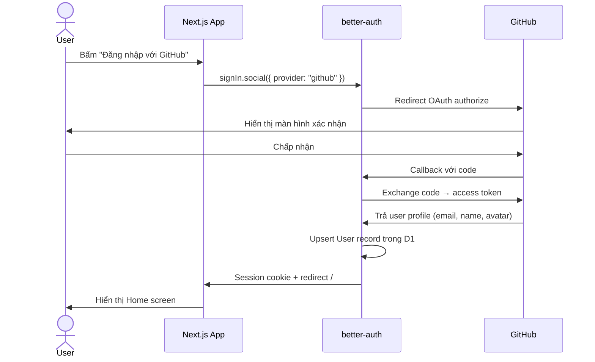
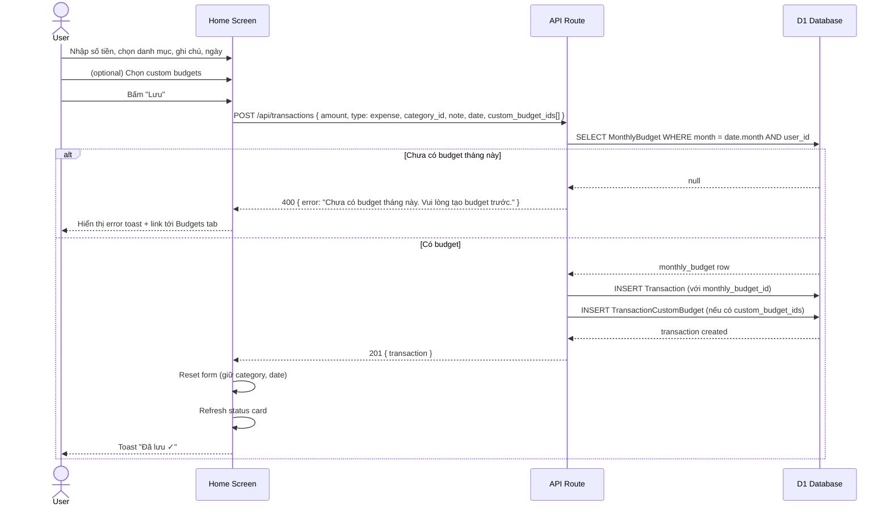
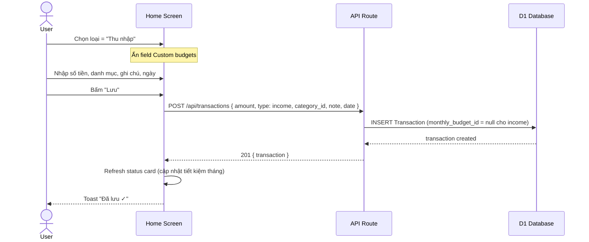
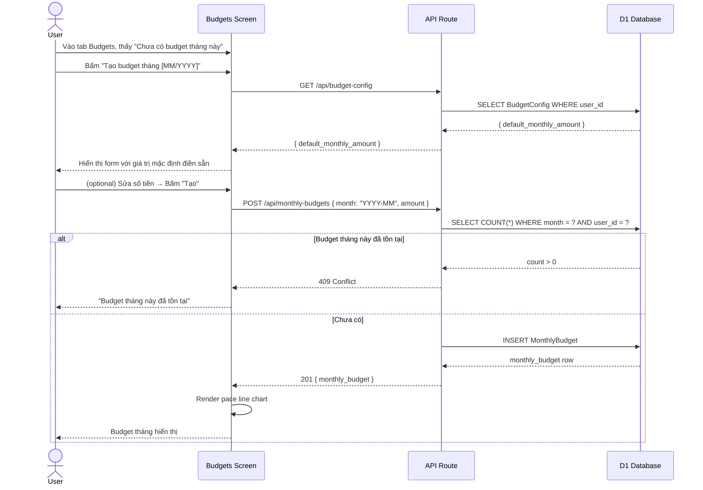
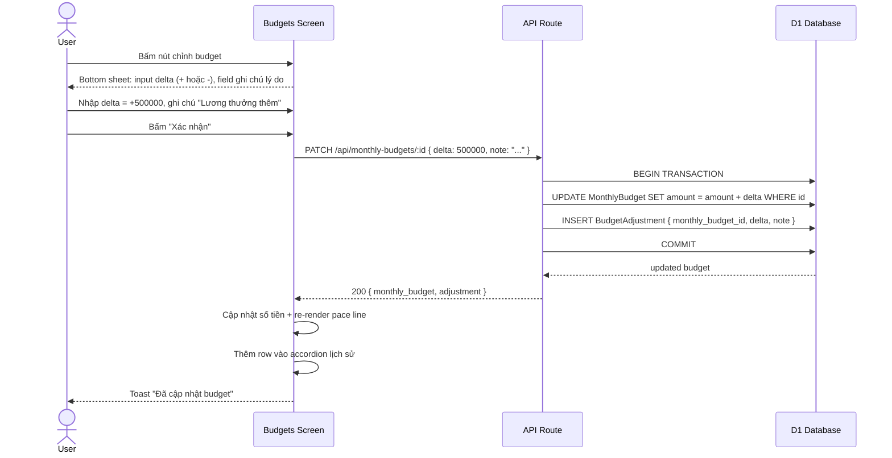
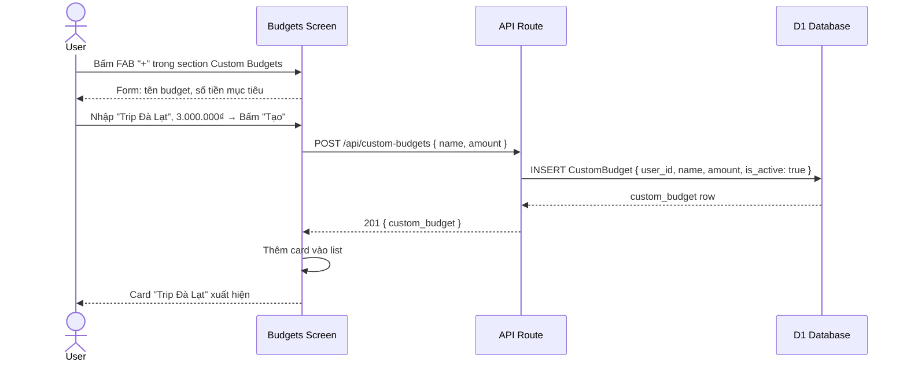
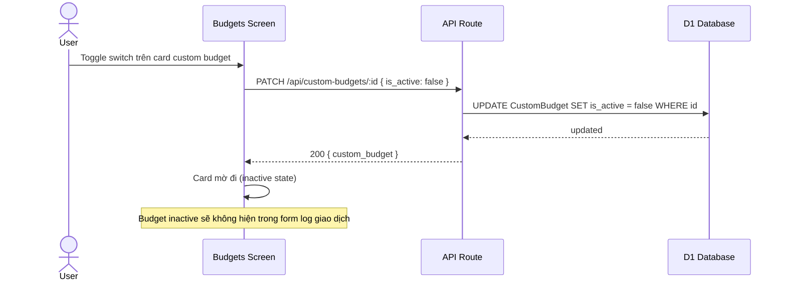
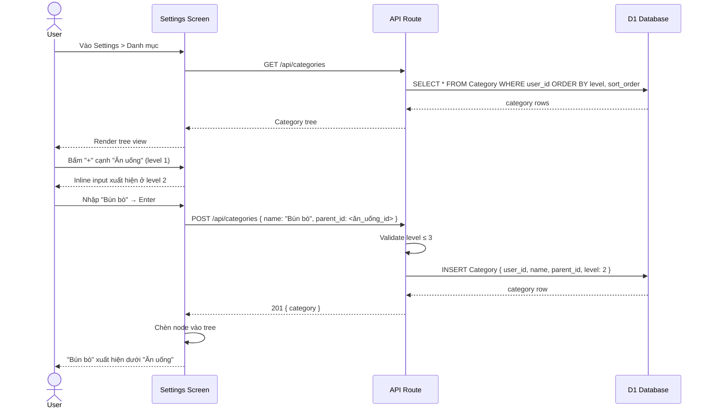
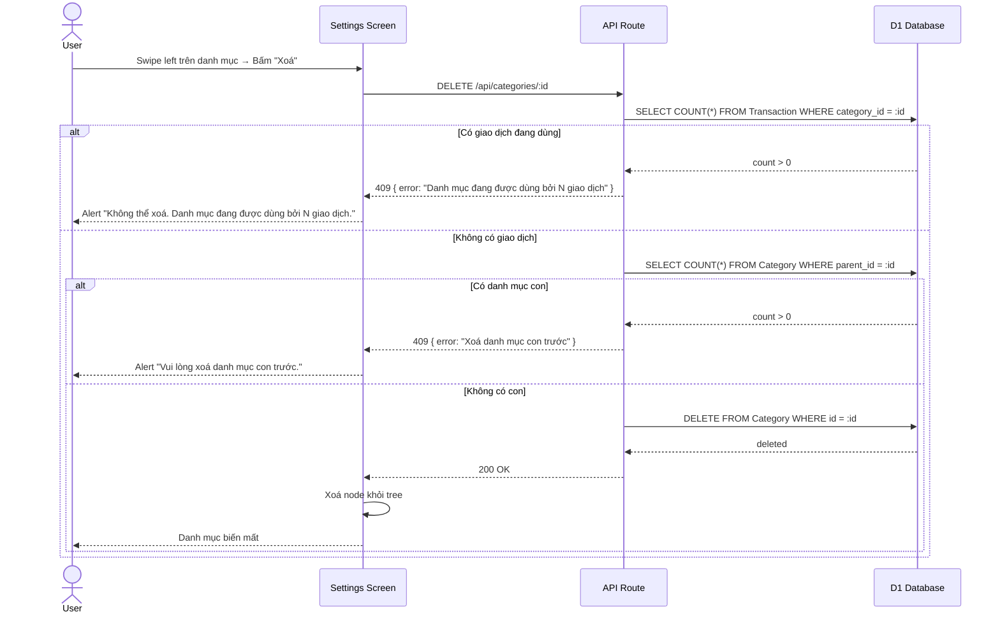
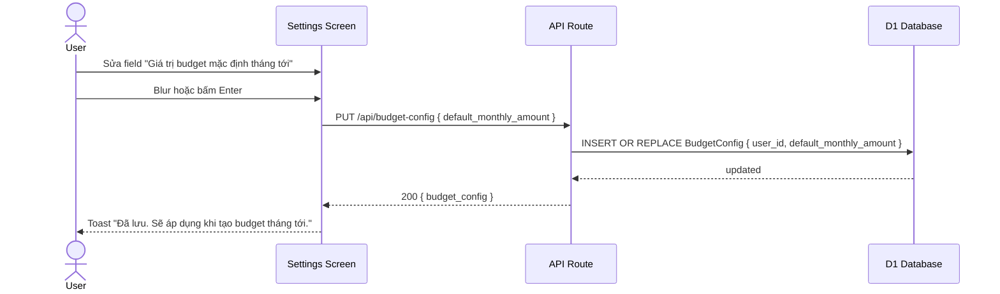

# Sequence Diagrams — Personal Finance Tracker

## Pre-condition: Authentication

> **Áp dụng cho tất cả flows từ #2 trở đi.**
>
> Mỗi request đến API Route đều phải đi qua bước xác thực session trước khi chạm vào bất kỳ business logic nào:
>
> ```
> API->>Auth: getSession(request.headers)
> alt Không có session hợp lệ
>     Auth-->>API: null
>     API-->>Client: 401 { error: "Unauthorized" }
> else Session hợp lệ
>     Auth-->>API: { user: { id, email, ... } }
>     -- tiếp tục flow bên dưới --
> end
> ```
>
> Ngoài ra, mọi query DB đều được scope theo `user_id = session.user.id`. Truy cập tài nguyên của user khác trả về `403 Forbidden`.

---

## 1. Đăng nhập (GitHub OAuth)



---

## 2. Log giao dịch chi tiêu



---

## 3. Log thu nhập



---

## 4. Tạo Monthly Budget thủ công



---

## 5. Chỉnh sửa Monthly Budget (tăng/giảm)



---

## 6. Tạo Custom Budget



---

## 7. Toggle Custom Budget active/inactive



---

## 8. Quản lý danh mục — Thêm danh mục



---

## 9. Xoá danh mục



---

## 10. Cập nhật Budget Config (giá trị mặc định tháng tới)


