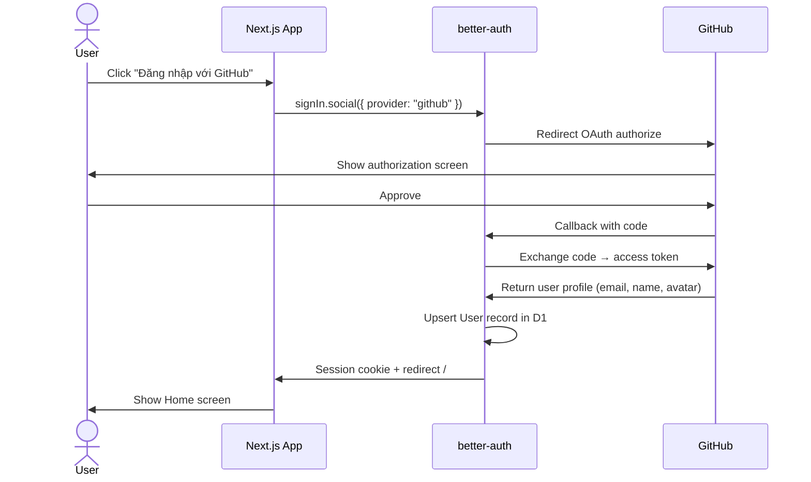
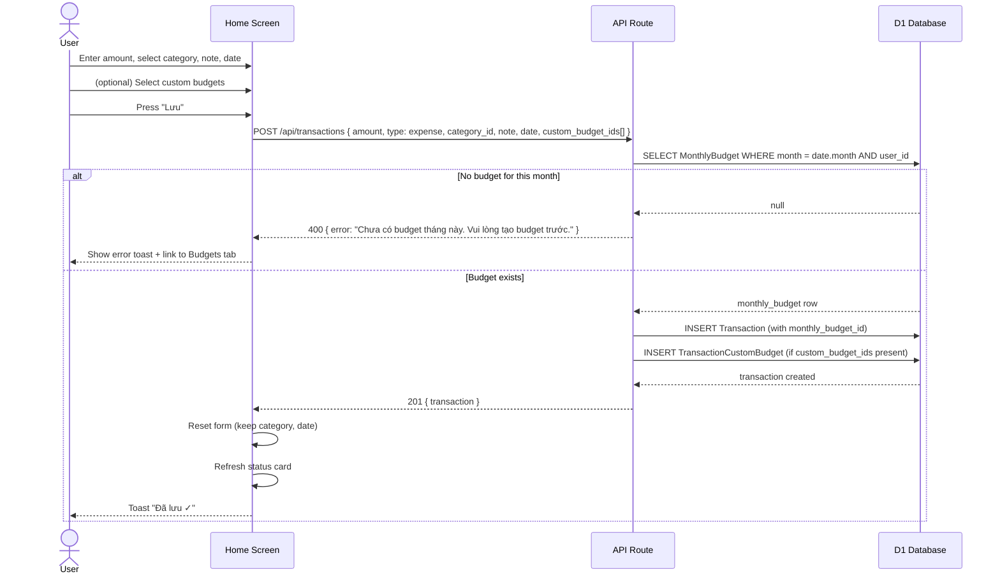
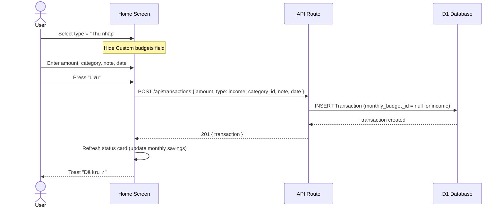
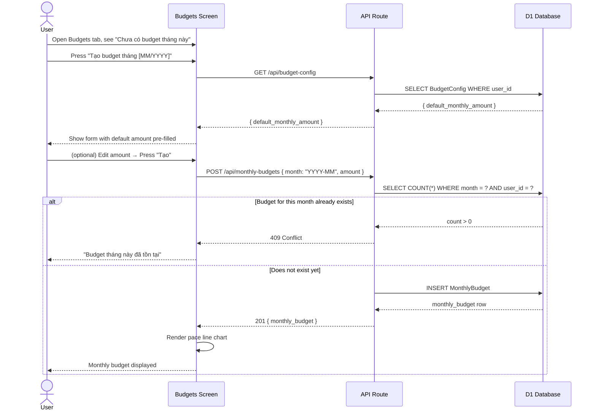
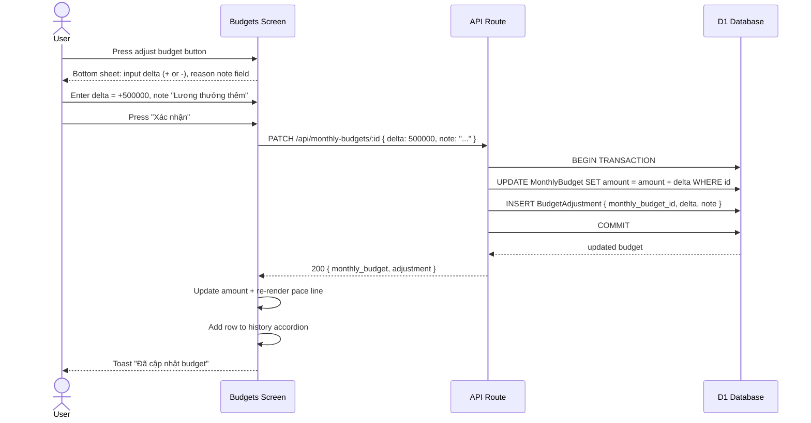
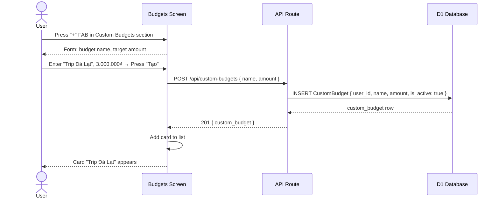
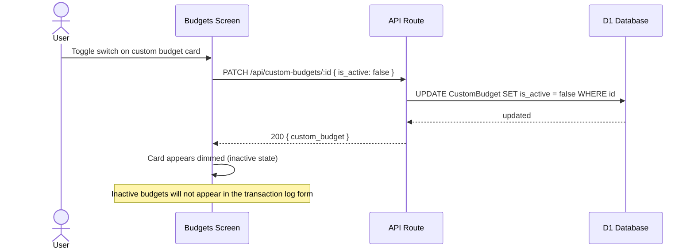
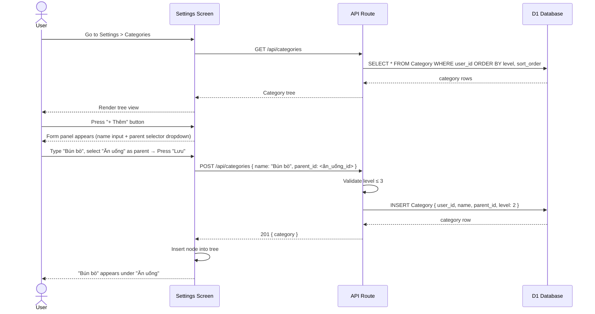
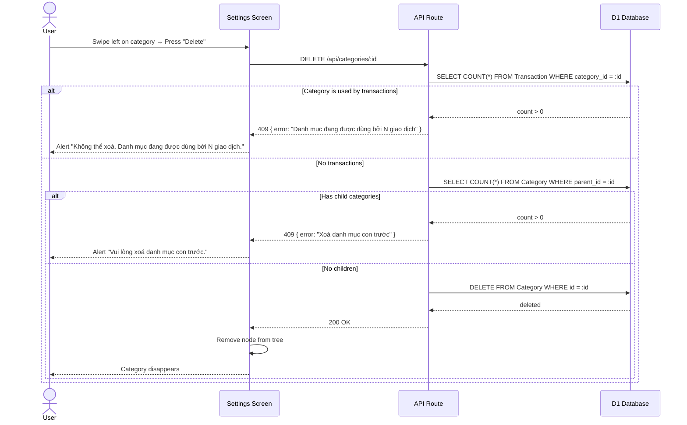
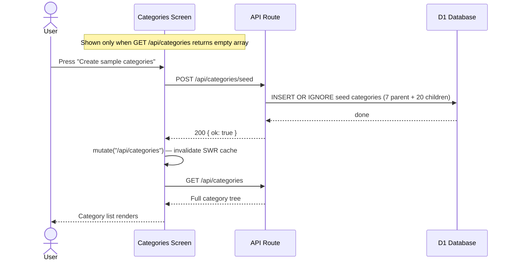

# Sequence Diagrams — Personal Finance Tracker

## Pre-condition: Authentication

> **Applies to all flows from #2 onwards.**
>
> Every request to an API Route must go through session authentication before touching any business logic:
>
> ```
> API->>Auth: getSession(request.headers)
> alt No valid session
>     Auth-->>API: null
>     API-->>Client: 401 { error: "Unauthorized" }
> else Valid session
>     Auth-->>API: { user: { id, email, ... } }
>     -- continue flow below --
> end
> ```
>
> In addition, all DB queries are scoped to `user_id = session.user.id`. Accessing another user's resources returns `403 Forbidden`.

---

## 1. Login (GitHub OAuth)



---

## 2. Log expense transaction



---

## 3. Log income transaction



---

## 4. Manually create Monthly Budget



---

## 5. Adjust Monthly Budget (increase/decrease)



---

## 6. Create Custom Budget



---

## 7. Toggle Custom Budget active/inactive



---

## 8. Category management — Add category



---

## 9. Delete category



---

## 10. Update Budget Config (default value for next month)


---

## 11. Seed categories on demand


